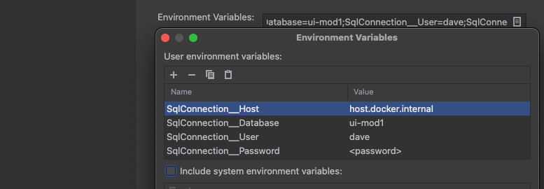

# Monetary Service
## Introduction
A preliminary service that exposes some public domain calculations related to DWD monetaries.  While this service is functional, and allows clients to submit requests and receive results, we expect this service to be refactored in the near future.  For example, it is possible that many of the endpoints will be removed and instead will be used internally by more coarse grained monetary operations such as CheckEligibility, EstablishMonetary, and RecalculateMonetary.  No final decision has been made, but any consumer of this service should anticipate it could change without notice.

## Solution Structure
* /DWD.UI.Monetary.Domain/ - C# .net class library containing monetary business logic in the form of business entities and use cases.
* /DWD.UI.Monetary.Service/ - C# .net asp.net core web api containing the web api layer in the form of controllers and mappers.
* /DWD.UI.Monetary.Tests/ - C# xunit test library containing unit tests.

## Dependencies
* .net 5 (base framework)
* asp.net core 5 (rest api)
* coverlet 3.0.2 (code coverage)
* swashbuckle 5.6.3 (swagger)
* xunit 2.4.1 (unit testing)

## Building and Testing
### Install .NET 6 SDK
Install the [.NET 6 SDK](https://dotnet.microsoft.com/download/dotnet/6.0).
### Build on command line
Please run the following command, from /DWD.UI.Monetary/, to build the software:
```
dotnet build
```
### Test on command line
Please run the following command, from /DWD.UI.Monetary/, to test the software:
```
dotnet test
```
## Executing
Please run the following command, from /DWD.UI.Monetary/DWD.UI.Monetary.Service/, to run the software in a local web server:
```
dotnet run
```

## Running in the Cloud Run Emulator
In production, the application is deployed to Cloud Run -- a fully managed Kubernetes instance. To fully test the application locally, you can run the application in Google's Cloud Run emulator. The [Cloud SDK](https://cloud.google.com/sdk/docs/install) and [Docker](https://docs.docker.com/engine/install/) are required. The application Docker file is located [here](https://github.com/flexion/dwd-ui-monetary-lab/blob/main/DWD.UI.Monetary/Deploy.dockerfile).

Below are the instructions for running in the emulator with or without IDE support. 

[Cloud Code emulator](https://cloud.google.com/run/docs/testing/local#cloud-code-emulator)
[Cloud SDK](https://cloud.google.com/run/docs/testing/local#cloud-sdk)
[Docker](https://cloud.google.com/run/docs/testing/local#docker)
[Docker with GCP Access](https://cloud.google.com/run/docs/testing/local#docker-with-gcp-access)

### Cloud Code Setup
Cloud Run is a Kubernetes instance. The Google Cloud Code plugin does a lot of the work to set up the Kubernetes environment for you. To deploy the API in the Cloud Run emulator, first begin by learning how to create, configure, and start Cloud Run container in the [Cloud Code emulator](https://cloud.google.com/run/docs/testing/local#cloud-code-emulator) documentation above.

The API makes use of a [Cloud SQL local instance](cloud_sql_local.md) and you should start that first. With the Cloud code configuration below, the app should be fully functional locally.

**Cloud Code: Cloud Run Configuration**
]

**Advanced revision settings: Environment Variables**

