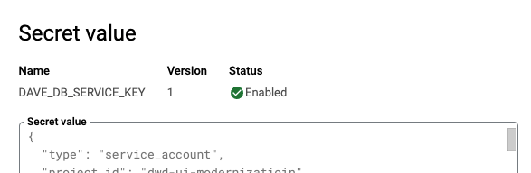

# Cloud SQL 
## Connect to Dave's Awesome DB

### Credentials from Google Secrets Manager

*Be sure you are logged in as your Lab GCP user. Use incognito mode to be sure.*

Get the [DAVE_DB_SERVICE_KEY](https://console.cloud.google.com/security/secret-manager/secret/DAVE_DB_SERVICE_KEY/versions?project=dwd-ui-modernizatioin) here and save the json to a file called key.json. You will need to refer to it later on.

The database password is stored in the [DAVE_DB_PASS](https://console.cloud.google.com/security/secret-manager/secret/DAVE_DB_PASS/versions?project=dwd-ui-modernizatioin). Keep that to login into the database instance. Use the same technique as above to reveal the secret contents.

### Install PostgreSQL client -- you install the server too.

~~~
% brew search postgres
==> Formulae
check_postgres      postgresql@10       postgresql@12       postgresql@9.4      postgresql@9.6      qt-postgresql
postgresql          postgresql@11       postgresql@13       postgresql@9.5      postgrest           postgis

==> Casks
navicat-for-postgresql        postgres-unofficial           postgrespreferencepane        sqlpro-for-postgres
% brew install postgresql
~~~

### Run the Cloud SQL Auth proxy container

Run self-container Docker that maintains Cloud SQL Auth proxy for local acccess to Cloud SQL deployments per [this](https://cloud.google.com/sql/docs/mysql/quickstart-proxy-test#cloud-sql-auth-proxy-docker-image).  You'll need to grab the service key file from the Secrets Manager [here](https://console.cloud.google.com/security/secret-manager/secret/DAVE_DB_SERVICE_KEY/versions?orgonly=true&project=dwd-ui-modernizatioin&supportedpurview=organizationId) and put it into you own key.json file. This will authorize the proxy to connect connect to GCP with the correct authorities.

~~~
% docker run -it \
-v $PWD/key.json:/key.json \
-p 127.0.0.1:5432:5432 \
gcr.io/cloudsql-docker/gce-proxy:latest \
/cloud_sql_proxy \
-instances=dwd-ui-modernizatioin:us-central1:daves-awesome-db=tcp:0.0.0.0:5432 \
-credential_file=/key.json

...
2021/11/23 17:39:18 current FDs rlimit set to 1048576, wanted limit is 8500. Nothing to do here.
2021/11/23 17:39:18 using credential file for authentication; email=daves-db-mod@dwd-ui-modernizatioin.iam.gserviceaccount.com
2021/11/23 17:39:19 Listening on 0.0.0.0:5432 for dwd-ui-modernizatioin:us-central1:daves-awesome-db
2021/11/23 17:39:19 Ready for new connections
2021/11/23 17:39:19 Generated RSA key in 367.9174ms
~~~

### Test your connection

Create a pgpass file to make things easy per https://www.postgresql.org/docs/current/libpq-pgpass.html

~~~
% echo "localhost:5432:ui-mod1:dave:{DAVE_DB_PASS}>" > ~/.pgpass
% chmod 0600 ~/.pgpass
~~

The psql client looks up you password by host/user/database combination.

~~
% psql -h localhost -U dave ui-mod1                                      
psql (14.1, server 13.4)

ui-mod1=> select * from  claimant_wages;
 id | claimant_id | wage_year | wage_quarter |    total_wages    
----+-------------+-----------+--------------+-------------------

~~~

### Set your local workspace up

Get secrets set up for local development.

~~~
% cd {workspace dir}/dwd-ui-monetary-lab/DWD.UI.Monetary/DWD.UI.Monetary.Service
% dotnet user-secrets set "SqlConnection:Password" "{DAVE_DB_PASS}"
Successfully saved SqlConnection:Password = **** to the secret store.
davepuglielli@flexion-mac-C02C34VKMD6N DWD.UI.Monetary.Service % cat ~/.microsoft/usersecrets/*/secrets.json
{
  "SqlConnection:Password": "****"
}%                                                                                                                                                             

~~~

### Enjoy
